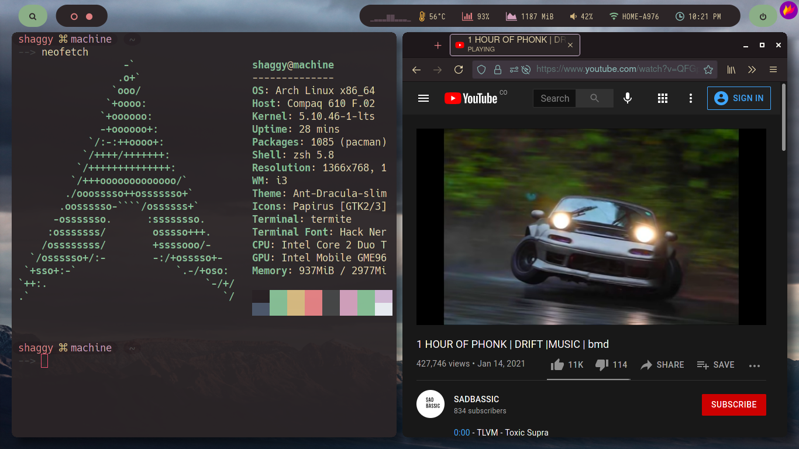

# dotfiles101
this is the whole configuration, i stole some dotfiles and modified them as i like (for the sake of not being a normie)

in terms of perfomance it behaves pretty well, is very minimal except for [Picom](https://wiki.archlinux.org/title/Picom), blur does not run as i expected, seem bloated just for now 
If you use dwm or xmonad, you might still have to slighly change some settings

### FIRST OF ALL
time for installing some dependencies.

[Neovim](https://wiki.archlinux.org/title/Neovim/)  · Text editor

[Polybar](https://wiki.archlinux.org/title/Polybar) · Taskbar

[I3](https://wiki.archlinux.org/title/I3) · Tiling window manager

[I3-Gaps](https://github.com/Airblader/i3) · Window gaps for i3

[I3-Rounded](https://aur.archlinux.org/packages/i3-gaps-rounded-git/) · Rounded corners for gaps

[Picom](https://wiki.archlinux.org/title/Picom) · Transparency & shadowing...

[Hack Nerd Fonts](https://aur.archlinux.org/packages/ttf-nerd-fonts-hack-complete-git/)

[Iosevka Nerd Font](https://aur.archlinux.org/packages/nerd-fonts-iosevka/)

**I suggest you to install Kitty or Alacritty as terminal**,
 my pc does not support opengl >3.3, if this is your case, your goto way is Termite.
 
----
### Optional
[Ant Dracula GTK Theme](https://aur.archlinux.org/packages/ant-dracula-gtk-theme/) · gtk theme daah

[Papirus Icon Theme](https://github.com/PapirusDevelopmentTeam/papirus-icon-theme) · Icons

[Bubblified](https://github.com/hohmannr/bubblified) · zsh theme

# Installation
Once you have installed dependencies

Execute to followig command
> git clone https://github.com/CodEsteban/dotfiles101 ~/.config/stolendotfiles && cd ~/.config/stolendotfiles 

Move up the folder you need
>mv [folder1] [folder2] ..
